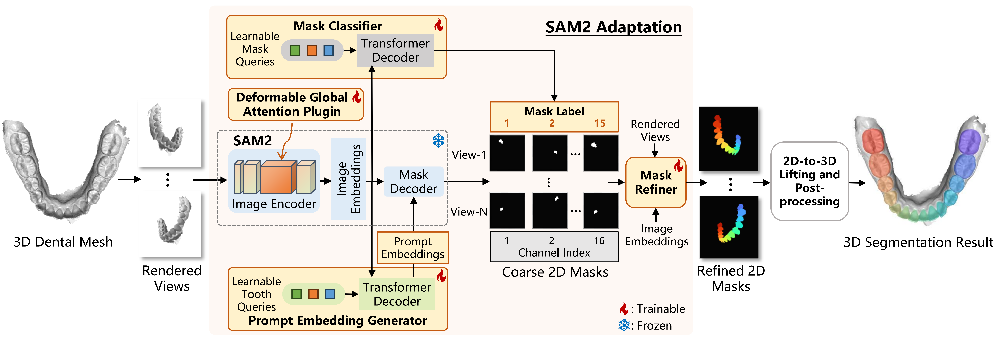

# 3DTeethSAM: Taming SAM2 for 3D Teeth Segmentation

Official PyTorch implementation of **3DTeethSAM: Taming SAM2 for 3D Teeth Segmentation** (AAAI 2026, oral).

3DTeethSAM adapts the 2D foundation model **SAM2** to perform **automatic 3D teeth instance segmentation** on high‑resolution intraoral scans by combining multi‑view rendering, lightweight adapters, and a 2D‑to‑3D lifting strategy.

> **Paper:** *3DTeethSAM: Taming SAM2 for 3D Teeth Segmentation* 


---

## Highlights

- SAM2‑based 3D teeth instance segmentation without changing SAM2 pre‑trained weights.
- Automatic prompting via **Prompt Embedding Generator (PEG)** (no manual clicks).
- **DGAP** plugins and lightweight adapters for efficient, tooth‑focused encoding.

**Main results on Teeth3DS:** 95.48% OA, 91.90% T‑mIoU, 70.05% B‑IoU, 94.33% Dice (see paper for details).


---

## Quick Start

```bash
# 1) install
conda create -n 3dteethsam python=3.10
conda activate 3dteethsam
pip install -r requirements.txt
pip install ninja
pip install --no-build-isolation "git+https://github.com/facebookresearch/pytorch3d.git"

# 2) download checkpoints to ckpts/ and model/sam2/checkpoints/
# 3) preprocess raw Teeth3DS-style data
python preprocess/preprocess.py --data_dir /path/to/raw_data --save_dir preprocess_data/npz

# 4) train (two stages)
python start_train.py --mode train --config configs/configm.json

# 5) inference
python start_inference.py --input_dir /path/to/inference_input --checkpoint ckpts/best.pth --output_dir inference_results
```

---

## Installation

Install dependent Python libraries by running the command below.

```bash
conda create -n 3dteethsam python=3.10
conda activate 3dteethsam
pip install -r requirements.txt
pip install ninja
pip install --no-build-isolation "git+https://github.com/facebookresearch/pytorch3d.git"
```
---

## Checkpoints

We provide original SAM2 weights (Hiera‑L) and our 3DTeethSAM checkpoints:

- Download: <https://drive.google.com/drive/folders/1-gGMov__sWje_2ONXyEq09yKPG-plTxU?usp=drive_link>
- Put SAM2 weights under `model/sam2/checkpoints/` (or update `sam_checkpoint`).
- Put 3DTeethSAM checkpoints under `ckpts/`.

---

## Data Preparation (Teeth3DS)

### Raw data layout

All scripts assume a Teeth3DS‑like organization:

```text
/path/to/raw_data/
├─ upper/CASE_ID/CASE_ID_upper.obj
├─ upper/CASE_ID/CASE_ID_upper.json
├─ lower/CASE_ID/CASE_ID_lower.obj
└─ lower/CASE_ID/CASE_ID_lower.json
```

Split files in `preprocess/split/official/*.txt` list case names as `CASEID_upper` / `CASEID_lower`.

### Multi‑view rendering and GT masks

```bash
python preprocess/preprocess.py \
  --data_dir /path/to/raw_data \
  --save_dir preprocess_data/npz
```

Each `.npz` stores multi‑view RGBs, GT masks, `tooth_ids`, and `valid_masks`. View poses and resolution are defined in `ToothPreprocessor` inside `preprocess/preprocess.py`.

### Convert NPZ to HDF5 (optional)

Training will auto‑create `config['h5_path']` if missing. Manual conversion:

```bash
python - <<'PY'
from model.dataset.hdf5 import convert_to_hdf5
convert_to_hdf5("preprocess_data/npz", "preprocess_data/h5/dataset.h5", views=7)
PY
```

---

## Training

`start_train.py` runs a two‑stage schedule:

- **Stage 1** (`model/trainer.py`): 30 epochs by default, producing `results/<timestamp>/checkpoints/best_model.pth`.
- **Stage 2** (`model/trainer_match.py`): resumes Stage‑1 best and continues to `config['epochs']` (default 100).

Configure paths/hyper‑params via `config/configm.py` or a JSON override:

```json
{
  "data_dir": "preprocess_data/npz",
  "h5_path": "preprocess_data/h5/dataset.h5",
  "train_split_path": "preprocess/split/official/training_all.txt",
  "val_split_path": "preprocess/split/official/testing_all.txt",
  "test_split_path": "preprocess/split/official/testing_all.txt",
  "sam_checkpoint": "model/sam2/checkpoints/sam2.1_hiera_large.pt",
  "save_dir": "results",
  "view_indices": [0,1,2,3,4,5,6]
}
```

Run:

```bash
python start_train.py \
  --mode train \
  --config configs/train_teeth3ds.json \
  --batch_size 4 \
  --finetune_sam   # only if you want to train SAM2 weights
```

AMP (float16/bfloat16) is supported by default; view sampling is controlled by `view_indices`.

---

## Inference

Prepare an input directory with the same upper/lower structure as training data (OBJ required, JSON optional):

```bash
python start_inference.py \
  --input_dir /path/to/inference_input \
  --checkpoint ckpts/best.pth \
  --output_dir inference_results \
  --num_views 7 \
  --device cuda:0 \
  --test_split_file preprocess/split/official/testing_all.txt \
  --accelerate
```

Outputs:

- per‑vertex labels: `inference_results/labels/<jaw>/<case>.txt`
- cleaned meshes for inspection: `*_cleaned.obj`
- logs: `logs/inference_logs`

`--equal_weights` enforces uniform voting weights; `--accelerate` enables `torch.compile` + AMP.

---

## Evaluation

```bash
python evaluate_metrics.py \
  --pred_dir inference_results/labels \
  --gt_dir /path/to/raw_data \
  --test_split_file preprocess/split/official/testing_all.txt \
  --log_file results/metrics.txt
```

The script reports OA, tooth‑wise mIoU, Dice, and bIoU.

---

## Citation

```bibtex
@misc{lu20253dteethsamtamingsam23d,
      title={3DTeethSAM: Taming SAM2 for 3D Teeth Segmentation}, 
      author={Zhiguo Lu and Jianwen Lou and Mingjun Ma and Hairong Jin and Youyi Zheng and Kun Zhou},
      year={2025},
      eprint={2512.11557},
      archivePrefix={arXiv},
      primaryClass={cs.CV},
      url={https://arxiv.org/abs/2512.11557}, 
}
```

---

## Acknowledgements

- Segment Anything Model 2 (SAM2) and its official implementation.
- Teeth3DS / 3DTeethSeg’22 organizers for providing the benchmark.
